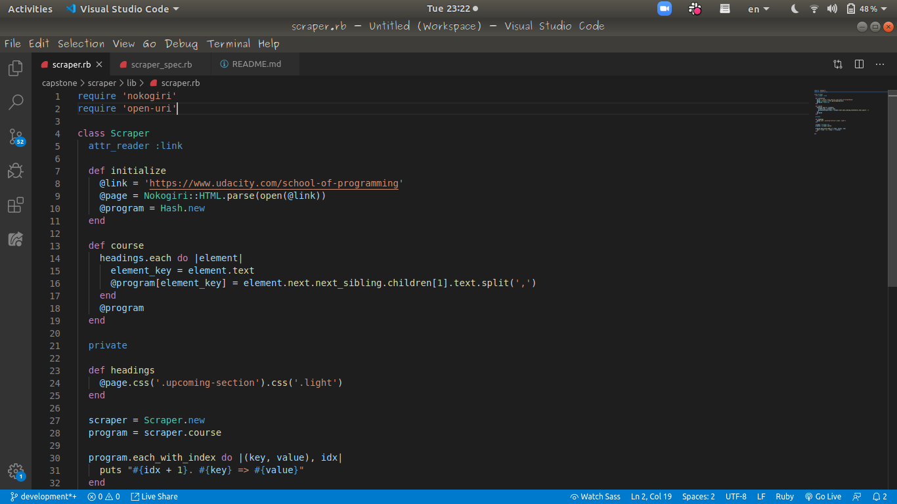

# Scraper
A Web Scraper is a program that quite literally scrapes or gathers data off of websites.

The main goal of this project is to put into practice concepts learned in Object Oriented Programming. Particularly, classes and access to their attributes.



Additional description about the project and its features.

## Built With

- Ruby
- Nokogiri
- HTTParty

## Nokogiri

* Nokogiri (鋸) is an HTML, XML, SAX, and Reader parser. Among Nokogiri's many features is the ability to search documents via XPath or CSS3 selectors.
Read more about it [here](https://github.com/sparklemotion/nokogiri)

## Getting Started

- Make sure you have ruby installed on your machine
- To do that, [go here](https://www.ruby-lang.org/en/documentation/installation/)
- Clone or download this project into your preferred directory in your machine
- Change your working directory into where the project is stored
- Make sure you have **Nokogiri** installed
- You can use this 
```
gem install nokogiri
``` 
- Or [go here](https://github.com/sparklemotion/nokogiri) if you have troubles installing Nokogiri
- Make sure **HTTParty** is installed
- You can do that by running 
```
gem install httparty
```
- Or go [here](https://rubygems.org/gems/httparty) to read more about it
- Once you are in the working directory of the scraper project, you can open your terminal and run this command ```ruby bin/main.rb``` which will then bring up the result of the parsed page
- You can read more about the project [here](https://www.notion.so/microverse/Build-your-own-scraper-f54eaca54d8a4d758a5f0141468127a8) to see its specifications

### Prerequisites

- Have Ruby installed version 2.7.0 or up

## Authors
👤 **Adewale Orotayo**

- Github: [@didymus707](https://github.com/didymus707)
- Twitter: [@Didy707](https://twitter.com/didy707)
- Linkedin: [linkedin](https://linkedin.com/adewale-thomas-orotayo)

## 🤝 Contributing

Contributions, issues and feature requests are welcome!

Feel free to check the [issues page](https://github.com/jubaan/m__oop__tic-tac-toe/issues?q=is%3Aissue+is%3Aopen+sort%3Aupdated-desc).

## Show your support

Give a ⭐️ if you like this project!

## Acknowledgments

- [Ruby Bastards Book](http://ruby.bastardsbook.com/toc/)
- [THE BEGINNER’S GUIDE: Scraping in Ruby Cheat Sheet](https://medium.com/@LindaVivah/the-beginner-s-guide-scraping-in-ruby-cheat-sheet-c4f9c26d1b8c)
- [Web Scraping with Ruby and Nokogiri for Beginners](https://www.distilled.net/nokogiri-and-ruby-web-scraping/)

## 📝 License

This project is [MIT](LICENSE.md) licensed.
